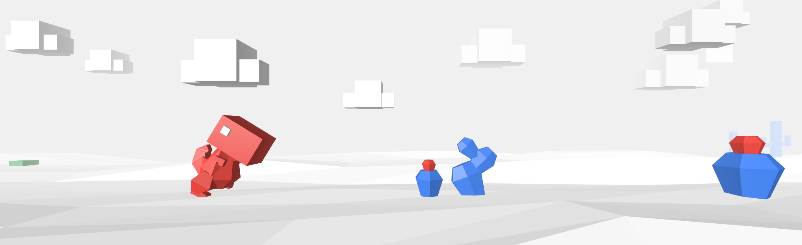

# 🐱‍🐉 Dino 404 game

A variation of the google Dino game that appears when you don't have internet. Made to gain experience with three.js.

The ⚡⚡⚡ mdDocumentation folder ⚡⚡⚡ contains some observations made during the project (bugs, research for lighting...). Other observations are made in the code itself as comment. 

### 🤓 Things I learned:
 * Documenting the process can help me (motivation wise) to spend more time on research and bugs.
 * Optimisation is tricky (the changes I made to optimize this project were not that difficult, but I would have a hard time planning in advance a more complex project and know in advance if it can perform well or not).
