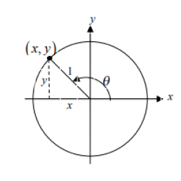
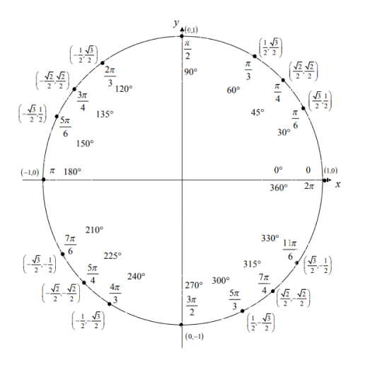
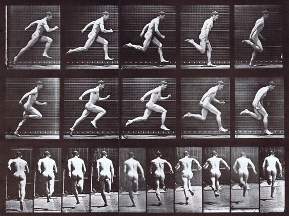
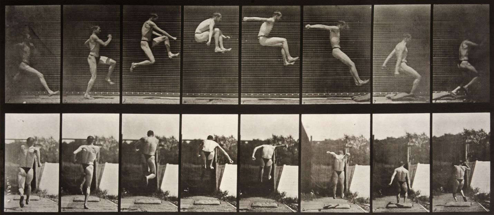
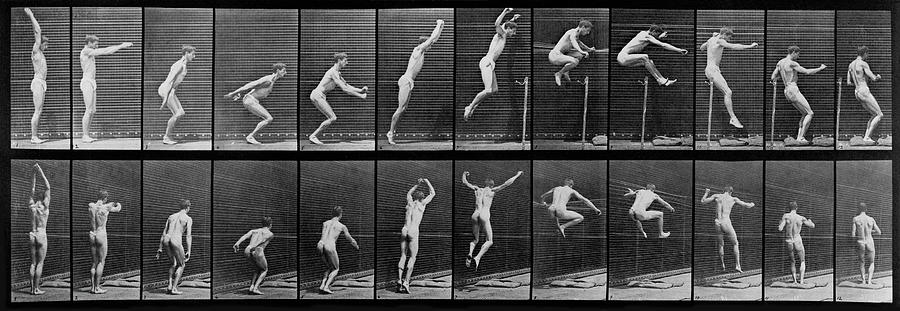

# Reasearch animation

## Trigonometry

[Tutorial on how to animate things in three.js with trigonometry](https://www.smashingmagazine.com/2017/09/animation-interaction-techniques-webgl/)

Value augments => goes toward the left (opposite of clockwise direction)  

When the value reaches Math.PI x 2 => the angle restarts from 0

## References

1. The T-rex character is based on the google game, therefore, it can use it as a reference  
   => Problem => The visual style is quite different, therefore having just the legs going up and down looks weird.
2. We can use a "real" T-rex for reference
   => Problem => the body of the real T-rex is different (proportions + it doesn't stand straight).
3. Can use humans as reference, since we stand straight.

## Running animation

## Observations, T-rex running cycle

### Body

After one of the feet reach the back, the body makes a small jump, leaving the ground, it comes back in contact with the other leg touching the front, then leave again when that leg reaches the back and push.

cycle => impact, jump, floats while going down, impact....

The body rotate, right and left, depending on the leg it's using as support.

### Arms

Arms go up and down

### Tail

The movement propagates progressively to the extremity of the tail

### Legs

Legs rotate to the front, before putting the foot down.

### Feet

The feet rotate during the running cycle, go toward the back when the leg is also toward the back, and toward the front before it comes in contact with the ground.

## Observations, human running cycle

### Torso

Torso is bent forward (that's an indication of speed => in the walking cycle, it stays straight).

### Arms

Arms are actively helping with the movement, in the opposite direction from the legs => when the right leg is toward the back, the right arm is toward the front (that's an indication of speed => in the walking cycle, the arms behave the same way, but the angle is a lot less extreme, they are a lot more engaged in the movement).

## Changes based on observations:

1. Body rotated forward to convey a higher speed
2. Legs rotating to reach for the floor

## Animation issues

### the tail doesn't rotate from the right origin

=> Fix => can make the tail go up and down when it rotates  
 => As long as the basis of the tail is connected to the body at the right place, looks fine

 => 2nd option, can change the origin of the object by translating it (way better, knowing how many objects need to have the origin of rotation changed)
 The translation should be applied on the geometry, not on the final 3D object.
 Can still use position.set() when we don't want to modify the origin of the geometry
 ex => footGeom.applyMatrix(new THREE.Matrix4().makeTranslation(5, 0, 0));

 To put the origin at the border, rather than the center, use half of the width (or height, or depth)

 Translations and position.set adds up, so if want to modify something in translation, without affecting the final position, need to correct it with position.set()

 Translation does not affect children.
 => it's better to do it first, since position.set() does affect children, so need to take it into account to set their position (and need to modify position.set to correct the changes made with translate)

### Need to find the right speed => running fast, but if do it too much, looks like the dino is receiving an electroshock

### Need performance to be good, or the animation won't play smoothly / fast

## Jumping animation

## Observations, human running cycle

## Head

The head is looking down.

## Torso

Torso goes down => is caught in between the legs going up and the arms.

## Arms

The arms go up, in the first part of the jump, and then go to the back of the body to help with its balance during the landing.

## Legs

Legs go to the front and fold, to not touch the obstacle / achieve a greater distance
