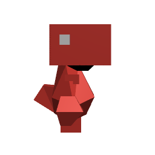
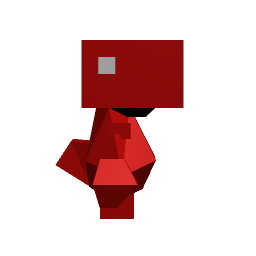
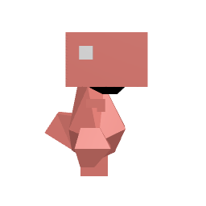
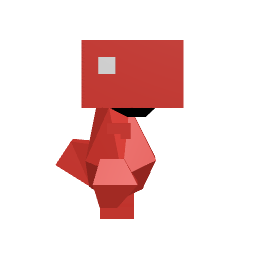

# Materials and Lights 💡

### 1st = Starting Point vs 2nd = new color setting

### New color setting 🎨
  
To have more accurate colors do this:  
const color = new Color(0x800080);
color.convertSRGBToLinear()  
[Ref =>](https://discoverthreejs.com/tips-and-tricks/#lights)  
  
=> OBSERVATION = need to use THREE.Color(), otherwise doesn't work (convertSRGBToLinear only works if the color is an instance of Color) 

### 1st = Starting Point vs 2nd = New renderer settings 

For (nearly) accurate colors, use these settings for the renderer:
renderer.gammaFactor = 2.2;
renderer.outputEncoding = THREE.sRGBEncoding;  
[Ref =>](https://discoverthreejs.com/tips-and-tricks/#lights)  

### 1st = Starting Point vs 2nd = New renderer settings + new color settings 

=> OBSERVATION = works well together, the shadows are less harsh

### 1st = New settings vs 2nd = New settings + Ambient light 

const ambientLight = new THREE.AmbientLight(0xffffff, 0.2);  
scene.add(ambientLight);  
  
=> OBSERVATION = can really wash out the picture if use too much (can have problems with volumes if the shadows don't let us read it => might improve with animation => easier for the eye to tell things appart if they are moving individually).

### 1st = New settings (with ambient light) vs 2nd = New direction for the directional light 

Before: shadowLight.position.set(150, 350, 350);
After: shadowLight.position.set(-150, 100, 250);
  

=> OBSERVATION = Not so important at the moment, since will probably change it again when the layout will be final.

### Comparison 1st try vs last 😎

